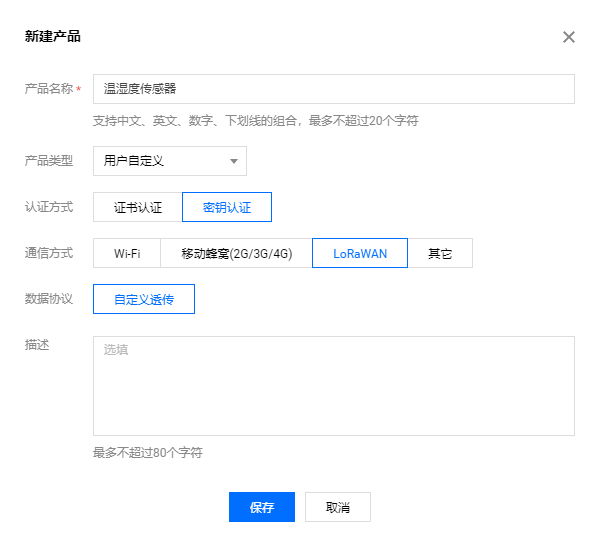
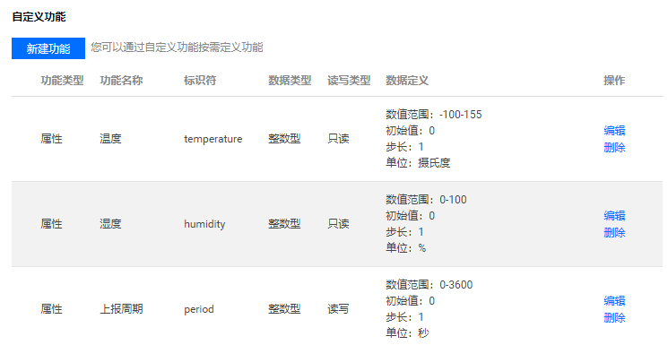
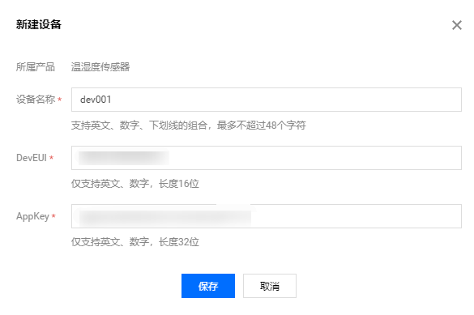
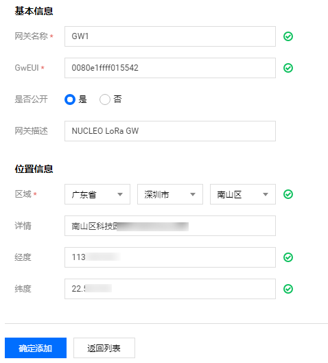
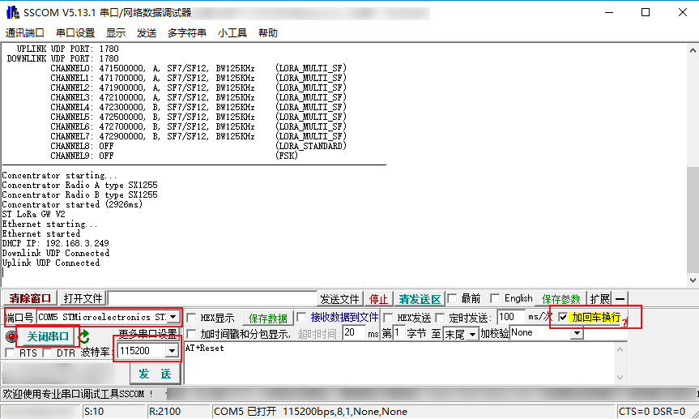
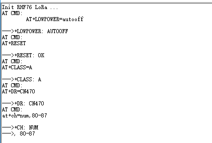

# 基于 TencentOS tiny 的 LoRaWAN 开发入门指南

## 1. ST P-NUCLEO-LRWAN3套件简介

### 1.1 开发套件简介

P-NUCLEO-LRWAN3是完整的套件，包括网关和节点，可用于评估LoRaWAN网络。使用该套件，用户可以轻松设置LPWAN网络，帮助用户学习LoRaWAN技术，了解如何在自己的应用程序中使用LoRaWAN技术。

LoRa网关套件由ST Nucleo-F746ZG底板和瑞兴恒方基于SX1301的LRWAN_GS模块组成。

ST Nucleo LoRa节点套件由LRWAN_NS1扩展板和ST Nucleo-L073底板组成。其中 LRWAN_NS1扩展板集成瑞兴恒方的RHF0M003 LoRaWAN模组，并集成了温湿度传感器HTS221、气压传感器LPS22HB、3轴磁力传感器LIS3MDL、6轴姿态传感器LSM6DS3共4个I2C传感器件。

开发套件实物图如下：


### 1.2 LoRaWAN节点硬件详解

#### 1.2.1  NUCLEO-L073RZ 基于CORTEX-M0+的评估板


NUCLEO-L073RZ基于NUCLEO 64公版PCB设计，可以方便的更换ST的其它64PIN MCU。主要特性包括：

- LQFP64 STM32-L073RZT6 MCU
- 20KB SRAM 192KB Flash 6KB data EEPROM
- 两种类型扩展接口：Arduino UNO扩展接口；STM32 MORPHO扩展接口
- 板载ST-LINK/V2-1调试/编程器
- 灵活的供电方式选择
- 板载3个LED灯，LD1、LD3指示工作状态，LD2为用户可编程LED灯
- 两个按钮，复位及用户可编程按钮
- USB重枚举能力，支持VCP，MSD，DEBUG功能
- 大量IDE开发环境支持

扩展接口如下图所示：


#### 1.2.2 LRWAN_NS1 扩展板硬件

1）扩展板接口兼容Arduino UNO接口，原理图如下：
 


2） 扩展板上同一个I2C端口，挂载了4个I2C接口的传感器，分别是温湿度传感器HTS221、气压传感器LPS22HB、3轴磁力传感器LIS3MDL、6轴姿态传感器LSM6DS3，原理图如下：
	 


3）LoRaWAN通信模组电路原理图


## 2. LoRaWAN节点软件开发环境准备

### 2.1 MDK软件介绍

MDK 即RealView MDK 或MDK-ARM（Microcontroller Development kit），是 ARM 公司收购Keil公司以后，基于uVision界面推出的针对ARM7、ARM9、Cortex-M0、Cortex-M1、Cortex-M2、Cortex-M3、Cortex-R4等ARM处理器的嵌入式软件开发工具。MDK-ARM 集成了业内最领先的技术，包括 uVision4 集成开发环境与 RealView 编译器RVCT。支持 ARM7、ARM9 和最新的Cortex-M3/M1/M0 核处理器，自动配置启动代码，集成 Flash 烧写模块，强大的 Simulation 设备模拟，性能分析等功能，与 ARM 之前的工具包 ADS 等相比，RealView 编译器的最新版本可将性能改善超过 20%。

Keil公司开发的ARM开发工具MDK，是用来开发基于ARM核的系列微控制器的嵌入式应用程序。它适合不同层次的开发者使用，包括专业的应用程序开发工程师和嵌入式软件开发的入门者。MDK包含了工业标准的Keil C编译器、宏汇编器、调试器、实时内核等组件，支持所有基于ARM的设备，能帮助工程师按照计划完成项目。

### 2.2 MDK安装

点击下面的地址下载MDK软件，软件版本最好是5.24及以上：
https://www.keil.com/download/product/
教程以5.24版本为例，双击MDK524应用程序文件，点击next>>。


打上 I agree前面的勾勾，即是同意一些安装协议。点击next>>。


选择安装路径，可以默认也可以安装在我们自己建立的文件夹下。点击next>>。


这里填写的是我们的一些信息，填写完整后，继续next>>。


然后等待安装完成即可。


安装完成，点击Finish。


然后会跳出来这个界面，这个我们后面再讲，先点OK，把弹框都叉掉。


激活MDK，导入License,激活MDK后便可使用了。


特别提示：一定要输入License激活MDK软件，请购买正版License。

### 2.3 Pack安装

安装完MDK后，我们需要安装开发套件中单片机型号对应的Pack。
安装方式一：登录官网：http://www.keil.com/dd2/pack/   
下载Keil.STM32L0xx_DFP.2.0.0.pack 后安装，如下图


安装方式二：MDK软件上在线安装
打开软件，在导航栏打开Pack安装界面，然后选择ok选项。


进入在线安装界面，选着STM32L0XX Pack,点击Install进行安装。


至此，我们开发板的单片机程序开发环境已经搭建完毕，重启MDK软件就可以使用了。

### 2.4 ST-Link驱动安装

前面讲了开发板单片机程序的开发环境的搭建，但是为了将程序烧录到开发板中我们还需要使用仿真器。我们这套开发板选用ST公司的ST-Link V2仿真器进行开发板程序的烧写和仿真，下面介绍ST-Link驱动的安装及环境搭建。  

在ST官网下载ST-Link驱动，
https://www.st.com/content/st_com/zh/products/development-tools/software-development-tools/stm32-software-development-tools/stm32-utilities/stsw-link009.html

（驱动有2种： 32位电脑系统安装“dpinst_x86”、64位电脑系统安装“dpinst_amd64”）。 


运行对应的驱动，安装ST-Link V2驱动程序。安装路径尽量保持默认路径。


安装完成后, 将ST-Link通过USB接口连入电脑。打开“设备管理器”。若看到如下图所示，表示驱动安装成功。


这里提醒 2 点:
1，	各种 windows 版本设备名称和所在设备管理器栏目可能不一样，例如 WIN10 插上STLINK 后显示的是 STM32 STLINK。
2，	如果设备名称旁边显示的是黄色的叹号，请直接点击设备名称，然后在弹出的界面点击更新设备驱动
至此， ST-Link 驱动已经安装完成。接下来大家只需要在 MDK工程里面配置一下 ST-Link即可。

### 2.5 编程软件(MDK)配置

安装驱动成功后，打开MDK软件，配置程序烧写和仿真的环境。
点击进入工程配置界面按纽，进入工程配置界面。


选择Debug选项，进入仿真器设置界面。


下拉仿真器选择列表，选着ST-Link Debugger并勾选右侧Use,点击Settings进入ST-Link V2仿真器配置界面。
 


开发板设计的程序烧录方式为SW，此处Unit选择ST-Link/V2,且Port选择SW,并确认右侧框内是否检测出SW设备，点击<确认>保存配置。


### 2.6 串口调试助手的安装与使用

工具下载： http://www.daxia.com/download/sscom.rar

安装方法：串口调试助手sscom5.13.1是免安装的，解压出压缩包即可直接使用。


根据PC和终端之间的连接，选择正确的串行端口。
打开电脑的设备管理器，在端口列表可以看到PC与开发板连接的端口号。


我这里显示的是COM6，所以要在sscom工具中选择COM6，开发板程序波特率设置为115200，所以我在sscom串口工具中选择115200波特率。

## 3. TencentOS tiny 基础内核实验

### 3.1 打开 TencentOS tiny提供的 Hello_world 工程

TencentOS tiny官方开源仓下载源码，地址为：
https://github.com/Tencent/TencentOS-tiny

进入 < TencentOS-tiny/board/NUCLEO_STM32L073RZ/KEIL/hello_world> 目录，打开TencentOS_tiny.uvprojx工程：


### 3.2 编译HelloWorld工程

打开工程后，我们在左侧的工程文件导航页面展开examples目录，可以看到helloworld.c源码，这里创建了两个TencentOS tiny的任务，交替运行打印任务。开发者安装下图指示，点击编译按钮即可编译工程，如图：


### 3.3 下载运行

首先需要配置下载环境


按下图所示配置下载参数


编译完成后点击如图所示”LOAD”按钮下载程序即可。


### 3.4 查看运行结果

连接好串口，在PC的串口助手中可以看到TencentOS tiny的两个任务交替运行，打印消息并完成任务计数，如下图所示：


更多TencentOS tiny基础内核的使用，请参考内核开发指南文档：
TencentOS_tiny\doc\04.TencentOS_tiny_Development_Guide.md
TencentOS_tiny\doc\05.TencentOS_tiny_SDK_documentation.md

## 4. 使用TencentOS tiny AT框架驱动LoRaWAN节点对接腾讯云IoT Explorer

本实验中假设一款 LoRa 温湿度传感器 接入到物联网开发平台，通过物联网开发平台可以远程查看传感器的温度、湿度，并可远程配置传感器的上报周期。本文档主要指导您如何在物联网开发平台控制台接入 LoRa 温湿度传感器。

### 4.1 控制台操作 LoRa 节点

#### 创建项目和产品
1. 登录 [物联网开发平台控制台](https://console.cloud.tencent.com/iotexplorer)，选择【新建项目】。
2. 在新建项目页面，填写项目基本信息后，单击【保存】
    - 项目名称：输入“LoRa 温湿度传感器演示”或其他名称。
    - 项目描述：按照实际需求填写项目描述。
3. 项目新建成功后，即可新建产品。

#### 新建产品
1. 进入该项目的产品列表页面，单击【新建产品】。
2. 在新建产品页面，填写产品基本信息。
    - 产品名称：输入“温湿度传感器”或其他产品名称。
    - 产品类型：选择“温湿度传感器”。
    - 认证方式：选择“密钥认证”。
    - 通信方式：选择“LoRaWAN”。

3. 产品新建成功后，您可在产品列表页查看“LoRa 温湿度传感器”。

#### 创建数据模板

单击产品名称，进入产品配置页，在【自定义功能】配置项下，单击【新建功能】，自定义产品功能。


#### 配置 LoRaWAN 参数

在设备开发页面中，按需调整 LoRaWAN 参数配置。本示例中使用默认的 OTAA 配置。


#### 设备数据解析
在设备开发页面中，按需调整设备数据解析。由于 LoRa 类资源有限设备不适合直接传输 JSON 格式数据，使用“设备数据解析”可以将设备原始数据转化为产品 JSON 数据。

##### 设备数据协议
在本示例中，设备上行数据共4字节：
- 第1字节：温度。
- 第2字节：相对湿度。
- 第3、4字节：表示上报周期（单位秒）。
- 设备下行数据为2字节：上报周期（单位秒）。

##### 数据解析脚本
上行数据解析的脚本主函数为 RawToProtocol，其带有 fPort、bytes 两个入参：
- fPort：设备上报的 LoRaWAN 协议数据的 FPort 字段。
- bytes：设备上报的 LoRaWAN 协议数据的 FRMPayload 字段。

脚本主函数的出参为产品数据模版协议格式的对象。

在上行数据解析部分，javascript 示例代码如下：
```javascript
function RawToProtocol(fPort, bytes) {
    var data = {
        "method": "report",
        "clientToken" : new Date(),
        "params" : {}
    };
    data.params.temperature = bytes[0];
    data.params.humidity = bytes[1];
    data.params.period = bytes[2] | (bytes[3] << 8);
    return data;
}
```

下行数据解析的脚本主函数为 ProtocolToRaw，其入参为产品数据模版协议格式的对象，其出参为至少3个字节的数组：

- 第1字节：下发给设备的 LoRaWAN 协议数据的 FPort 字段。
- 第2字节：bytes 为下发给设备的 LoRaWAN 协议数据的 MType（0表示 Unconfirmed Data Down，1表示 Confirmed Data Down）。
- 第3字节：开始为下发给设备的 LoRaWAN 协议数据的 FRMPayload 字段。

在下行数据解析部分，javascript 示例代码如下：
```javascript
function ProtocolToRaw(obj) {
    var data = new Array();
    data[0] = 5;// fport=5
    data[1] = 0;// unconfirmed mode
    data[2] = obj.params.period & 0x00FF;
    data[3] = (obj.params.period >> 8) & 0x00FF;
    return data;
}
```


##### 脚本模拟测试
您也可使用数据解析页面下方的模拟调试工具，如需开发更多的功能，请使用以下模拟脚本。

- 上行消息

设备原始数据为 0x113DB80B，我们将其转化为数组，即上行模拟数据为：[17,69,30,0]，填入设备上行数据的编辑框中。单击【运行】，即可在模拟调试界面右侧查看结果。


- 下行消息

模拟测试数据如下，将其填入设备下行数据的编辑框中：

```json
{
	"params": {
		"period": 15
	}
}
```


#### 创建测试设备

在设备调试页面中，单击【新建设备】，设备名为 dev001。

DevEUI 等信息可从 LoRa 节点开发板背面贴纸上获取。



### 4.2 控制台操作 LoRa 网关

1. 登录 [物联网开发平台控制台](https://console.cloud.tencent.com/iotexplorer)，选择上文 “控制台操作 LoRa 节点” 中对应的项目。
2. 在左侧工具列表中，选择【服务中心】>【LoRa 网关管理】。
3. 进入 LoRa 网关管理页面，选择【添加网关】。


4. 在新建网关页面，填写网关基本信息。
    - 网关名称：本示例中填写 GW1。
    - GwEUI：为网关唯一ID。本例中根据 ST NUCLEO LoRa GW 背部的 MAC 地址，将6字节 MAC 地址的中间补足0xffff。  

    - 是否公开：选择“是”，表示社区开发者可在社区网络查看该网关，并可通过这个网关进行 LoRa 节点接入；选择“否”，则仅用户自己能查看该网关。

5. 网关新建成功后，您可在网关列表页查看“GW1”。


### 4.3 LoRa网关实物操作

#### 硬件连接

整个系统搭建需要由LRWAN_GS_LF1网关（网关模组和 STM32F746 Nucleo核心板）、5V适配器和电脑组成。

1. 先使用 5V 适配器通过 USB 线连接到 LRWAN_GS_LF1 网关的网关模组上的 Micro USB 接口，给整个网关供电。
2. Nucleo 核心板上的 Micro USB 口（非以太网口那边的 Micro USB 口），通过 USB 线连接到 PC 端，可以实现虚拟串口的功能。
3. 网关开发板通过网线连接到上一级路由器的 LAN 口，从而可以实现 DHCP 的方式连接以太网。


#### 串口准备

1. 硬件连接成功后，打开 PC 上的设备管理器，即可查看网关所对应的串口（请确保已安装 stlink 驱动）。


2. 打开串口工具，做好相应配置后，打开串口。
   - 端口号。本例中为 COM5。
   - 波特率。本例中为 115200。




#### 配置修改

请按照如下步骤完成相关配置：
1. 按照上图完成硬件连接和系统搭建。  
2. 配置服务器地址。本示例中设置的是腾讯云物联网开发平台的 LoRa 服务器地址（接入域名：`loragw.things.qcloud.com`，接入端口：1700）。 
```
AT+PKTFWD=loragw.things.qcloud.com,1700,1700  
```
3. 配置频率计划。调整频点信息到486.3MHz - 487.7 MHz，指令修改如下（需要逐条发送）：
```
AT+CH=0,486.3,A
AT+CH=1,486.5,A
AT+CH=2,486.7,A
AT+CH=3,486.9,A
AT+CH=4,487.1,B
AT+CH=5,487.3,B
AT+CH=6,487.5,B
AT+CH=7,487.7,B
AT+CH=8,OFF
AT+CH=9,OFF
```
示例截图如下所示：

4. 其他指令。  
 - 通过“AT+log=on”打开网关日志。  
 - 通过“AT+EUI”查询网关的 ID。  


#### 运行

通过 AT+Reset 即可复位网关，开始服务器连接。

从串口日志查看：
```
LORAWAN SERVER: loragw.things.qcloud.com 
```
表明服务器地址修改成功。
```
Ethernet started
DHCP IP: 192.168.3.249
Downlink UDP Connected
Uplink UDP Connected
```
表明网关 DHCP 入网成功，网络连接正常。


### 4.4 LoRa 节点实物操作
#### 编译及下载

##### Step 1. 下载 LoRaWAN 例程
1. 请下载 TencentOS tiny 官方开源仓 [下载源码](https://github.com/Tencent/TencentOS-tiny) 。
2. 进入`<TencentOS-tiny\board\NUCLEO_STM32L073RZ\KEIL\lorawan>`目录，打开 TencentOS_tiny.uvprojx 工程。
3. 示例工程包含 STM32L073 外设驱动、TencentOS tiny 内核、AT 框架、RHF76 LoRaWAN 模组驱动、LoRaWAN 示例案例。

##### Step 2. 代码修改
1. 请先修改`\examples\LoRaWAN\lora_demo.c.`。
```c
tos_lora_module_join_otaa("8cf957200000f806", "8cf957200000f8061b39aaaaad204a72");
```
填入节点相应的 DevEUI 和 AppKEY，可从 LoRa 节点开发板背面贴纸上获取。
2. 修改`\devices\rhf76_lora\RHF76.h`。
```c
#define RHF76_ATCMD_SET_CHANNEL                 "at+ch=num,0-7\r\n"
```
由于本示例中计划使用80 - 87信道，因此调整为：
```c
#define RHF76_ATCMD_SET_CHANNEL                 "at+ch=num,80-87\r\n"
```

##### Step 3. 编译
单击 MDK 工具栏【Rebuild All】，编译整个工程。


##### Step 4. 下载
单击 MDK 工具栏【Download】，下载编译好的固件。

#### 查看运行结果

1. 节点下载好固件后，会自动重启运行，从串口即可查看设备的运行日志。

2. 当您看到串口打印如下日志，即说明 LoRa 节点已经通过网关成功入网。
```
--->+JOIN: Network joined
--->+JOIN: NetID 000035 DevAddr 6B:CC:9B:5D
```

### 4.5 查看设备状态

1. 保持 LoRa 节点和 LoRa 网关 为运行状态。
2. 进入【控制台】>【产品开发】>【设备调试】，可查看到设备 "dev001" 。
3. 单击【调试】，可进入设备详情页。

4. 单击【设备属性】，可查询设备上报到开发平台的最新数据及历史数据。
 - 设备属性的最新值：会显示设备上报的最新数据。
 - 设备属性的更新时间：显示数据的更新时间。

5. 单击【查看】，可查看某个属性的历史上报数据。

### 4.6 查看设备通信日志

单击【设备日志】，可查询该设备某段时间范围的所有上下行数据。
 - 上行：上行指设备端上报到开发平台的数据。
 - 下行：下行指从开发平台下发到设备的数据。


### 4.7 在线调试

1. 当 LoRa 节点 成功连接到物联网开发平台后，您可在控制台【设备调试】列表，单击【调试】，进入在线调试。
2. 将“上报周期”设置为15秒，单击【发送】。

3. 查看 LoRa 节点的串口日志，可查看已成功接收到下发的数据。
 >?
 - 由于本示例中 LoRa 节点是 LoRaWAN Class A 类设备，这类设备不会立即下发数据，需要在有数据上行后，服务器才会向该设备下行数据。
 - 因此在 LoRa 节点上报数据之后，才能查看下发的周期调整命令。

LoRa 节点的串口会显示如下日志，表示成功下发了指令到设备端。
```
rhf76_incoming_data_process 4: 0F00
len: 2
data[0]: 15
data[1]: 0
report_period: 15
```
