# 基于TencentOS tiny官方EVB MX+开发板的IAP

## 1. 什么是IAP

以下内容引自正点原子《STM32F429开发指南-HAL库版本_v1.1》第五十七章，如侵权请联系删除。

> ​		IAP（ In Application Programming）即在应用编程， IAP 是用户自己的程序在运行过程中对User Flash 的部分区域进行烧写，目的是为了在产品发布后可以方便地通过预留的通信口对产品中的固件程序进行更新升级。 通常实现 IAP 功能时，即用户程序运行中作自身的更新操作，需要在设计固件程序时编写两个项目代码，第一个项目程序不执行正常的功能操作，而只是通过某种通信方式(如 USB、 USART)接收程序或数据，执行对第二部分代码的更新；第二个项目代码才是真正的功能代码。这两部分项目代码都同时烧录在 User Flash 中，当芯片上电后，首先是第一个项目代码开始运行，它作如下操作：
> ​		1）检查是否需要对第二部分代码进行更新
> ​		2）如果不需要更新则转到 4）
> ​		3）执行更新操作
> ​		4）跳转到第二部分代码执行
> ​		第一部分代码必须通过其它手段，如 JTAG 或 ISP 烧入；第二部分代码可以使用第一部分代码 IAP 功能烧入，也可以和第一部分代码一起烧入，以后需要程序更新时再通过第一部分 IAP代码更新。
>
> ​		我们将第一个项目代码称之为 Bootloader 程序，第二个项目代码称之为 APP 程序，他们存放在 STM32F429 FLASH 的不同地址范围，一般从最低地址区开始存放 Bootloader，紧跟其后的就是 APP 程序。


## 2. TencentOS tiny的IAP程序

### 2.1 BootLoader程序

​		如第一章所言，一个IAP例程一般由BootLoader及APP两部分构成，其中BootLoader起引导板子启动并提供APP下载烧录选项。

​		基于TencentOS tiny官方EVB MX+开发板，提供了官方IAP BootLoader程序，对应的keil工程位于：

```
board\TencentOS_tiny_EVB_MX_Plus\KEIL\iap\bootloader
```

​		与正常的应用程序编译烧写流程一致，双击打开keil工程后，将BootLoader烧写进开发板。

​		按下复位键后，BootLoader会直接进入加载并运行APP的流程。

​		这里为了演示IAP流程，让BootLoader进入APP升级模式，具体的做法是按住板上F2按键的同时，再按下复位键：

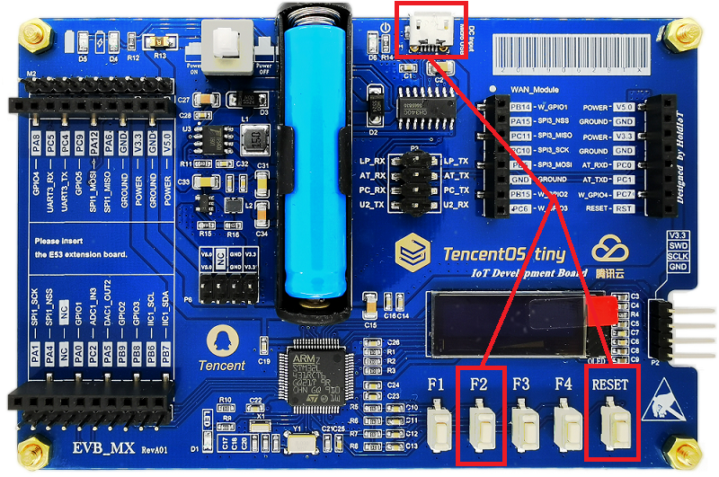


​		将microUSB（板上USART2）接到电脑上，打开串口调试助手，并将波特率选为115200，可以看到BootLoader的菜单：

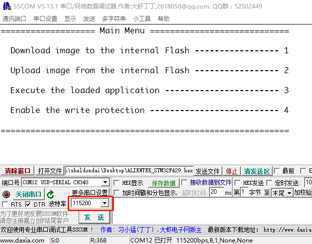

​		BootLoader的四个菜单选项分别是：

1. 通过串口ymodem协议下载APP镜像到板子内部FLASH

2. 通过串口ymodem协议上传板子内部FLASH上的APP镜像
3. 执行APP
4. 使能内部FLASH写保护

## 2.2 APP程序

​		基于TencentOS tiny官方EVB MX+开发板，提供了官方示例APP程序，由hello world示例修改而来，对应的keil工程位于：

```
board\TencentOS_tiny_EVB_MX_Plus\KEIL\iap\application
```

​		因为IAP中的APP是由BootLoader来跳转执行的，BootLoader只能跳转执行bin格式的APP程序，因此需要添加将APP程序转成bin格式的流程：

### 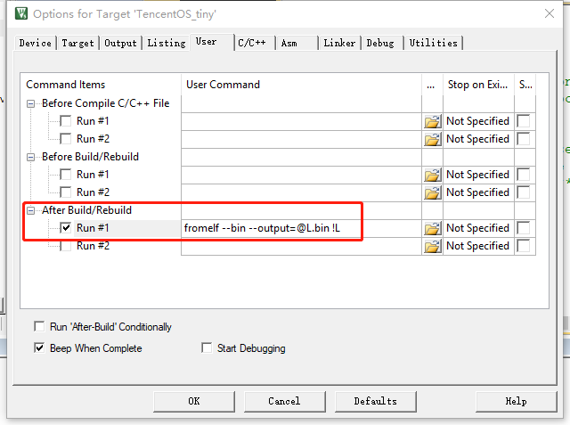

​		同时，要确保system_stm32l4xx.c中的VECT_TAB_OFFSET宏被定义成0x8000：

```
#define VECT_TAB_OFFSET  0x8000 /*!< Vector Table base offset field.
                                   This value must be a multiple of 0x200. */
```

​		编译application程序，在board\TencentOS_tiny_EVB_MX_Plus\KEIL\iap\application目录下会生成TencentOS_tiny.bin，这个就是在IAP升级中要传输并烧录进开发板的APP镜像。

## 3. IAP APP升级演示

### 3.1 基于xshell与普通串口的APP升级

​		因为APP传输到开发板上是通过ymodem协议，普通的串口调试工具没有集成ymodem协议，这里通过xshell来演示APP的ymodem协议。实际上，通过SecureCRT等其他集成有ymodem及串口协议的终端皆可。

​		用xshell连接到开发板串口上，并按住开发板F2键同时复位开发板进入BootLoader升级模式，在BootLoader菜单提示下，xshell中输入“1”进入APP下载及升级模式。

​		此时开发板会进入等待串口通过ymodem发送APP的状态。在xshell的文件——传输——YMODEM(Y)——用YMODEM发送(S)：

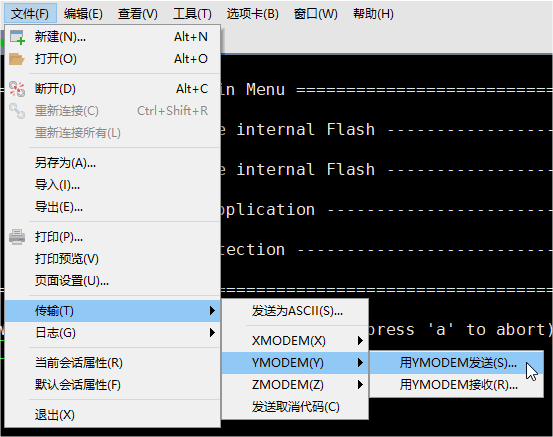

​		在弹出的对话框中，选择2.2节中编译生成的bin格式的APP：

```
board\TencentOS_tiny_EVB_MX_Plus\KEIL\iap\application\TencentOS_tiny.bin
```

​		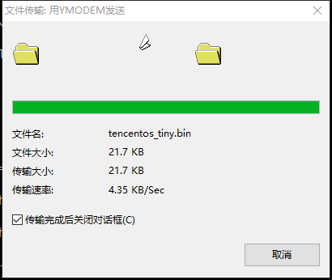

​		开发板接收完毕后会将接收到的APP bin写入内部FLASH，写入完成后会打印提示：


​		此时BootLoader会再次进入菜单模式，在菜单模式下输入3即可执行刚刚写入的APP bin：


### 3.2 基于小程序与BLE透传串口的APP升级

​		除了3.1节的传统串口升级，TencentOS tiny官方另外提供了基于BLE透传串口的IAP APP升级配套小程序。

​		这里基于HC-08蓝牙透传模块讲解如何使用小程序进行IAP APP升级。

​		我假设你的HC-08（或其他相似的蓝牙透传串口）波特率为115200，如果不是，可以通过查阅相关产品资料手册将波特率修改为115200；或者改动BootLoader及application中USART2的波特率为你的模块的波特率。

​		HC-08与开发板的接线参考下图：

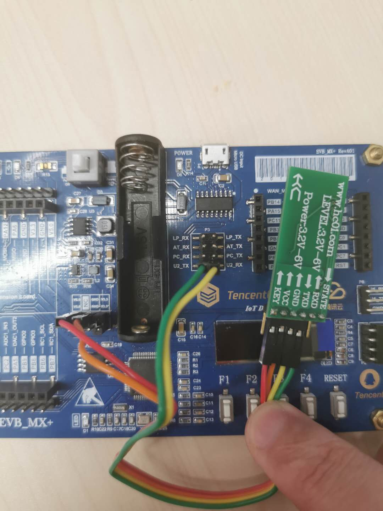

| HC-08 | EVB MX+ |
| ----- | ------- |
| RXD   | U2_TX   |
| TXD   | U2_RX   |
| GND   | GND     |
| VCC   | V5.0    |

​		打开tools\Mini_Program\iap目录中的小程序，用微信扫码开始使用小程序：

1. 打开手机蓝牙

2. 搜索连接HC-08的蓝牙广播

   

3. 按住F2复位开发板可以在小程序中的串口输出中收到开发板的BootLoader菜单

   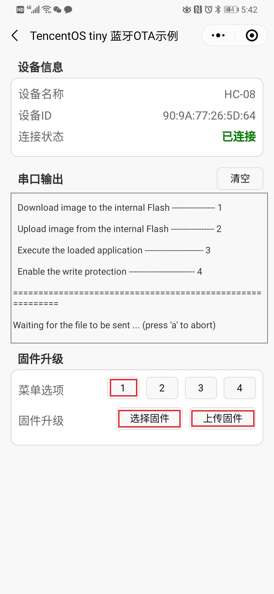

4. 在固件升级中，点击菜单选项“1”，再点击"选择固件"，通过文件传输助手选择TencentOS_tiny.bin

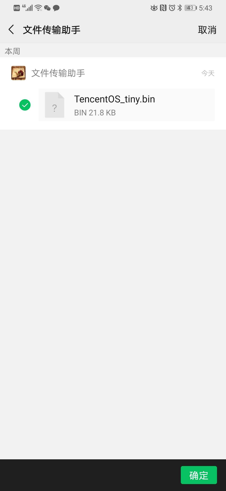

5. 点击“上传固件”，等待APP传输并烧写完毕：

   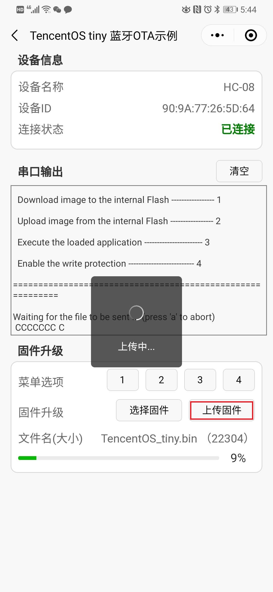

6. 等待镜像传输并烧写完毕后，在BootLoader的菜单选项下，点击菜单选项“3”执行刚才烧录的APP：

   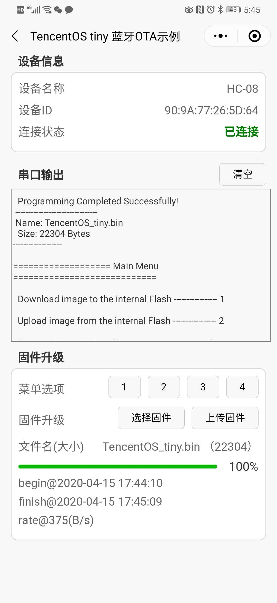


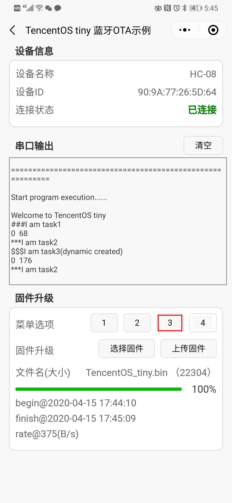